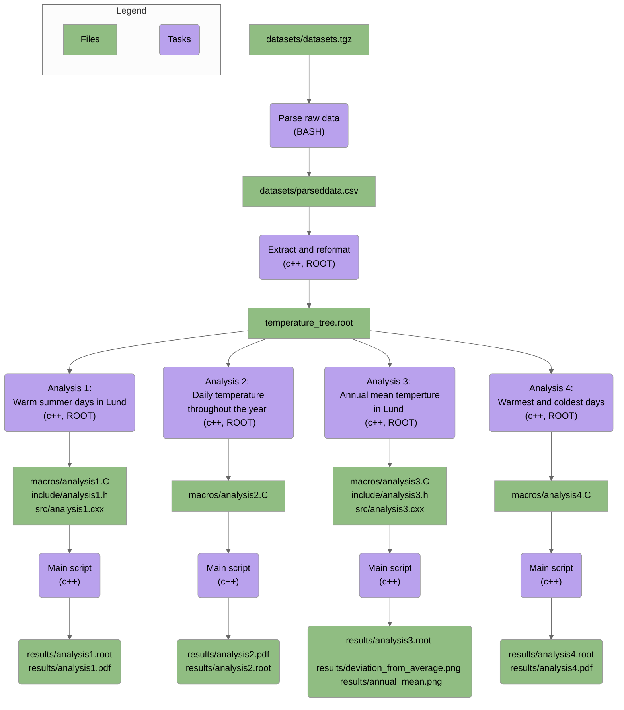

# Workplan for MNXB11 project

Team number: 8

Team members: David Chelidze, Estrella González Gómez, Joel Johansen, Maja Solman Wålsten and Evelina Vedin Meijer. 

# Workflow chart

```mermaid
%%{init: { 'theme':'neutral', 'fontSize': '11px'} }%%
flowchart TD
    %% This will be the same for all analyses
    A["datasets/datasets.tgz"] --> B("Parse raw data <br> (BASH)")
    B --> C["datasets/parseddata.csv"]
    C --> D("Extract and reformat <br> (c++, ROOT)")
    D --> E["temperature_tree.root"]

    %% The seperate analyses
    E --> G("Analysis 1: <br> Warm summer days in Lund <br> (c++, ROOT)")
    E --> H("Analysis 2: <br> Daily temperature throughout the year <br> (c++, ROOT)")
    E --> I("Analysis 3: <br> Annual mean temperture in Lund <br> (c++, ROOT)")
    E --> J("Analysis 4: <br> Warmest and coldest days <br> (c++, ROOT)")

    %% Analysis 1 workflow
    G --> G1["macros/analysis1.C <br> include/analysis1.h <br> src/analysis1.cxx"]
    G1 --> G2("Main script <br> (c++)")
    G2 --> G3("results/analysis1.root <br> results/analysis1.pdf")

    %% Analysis 2 workflow
    H --> H1["macros/analysis2.C"]
    H1 --> H2("Main script <br> (c++)")
    H2 --> H3("results/analysis2.pdf <br> results/analysis2.root")

    %% Analysis 3 workflow
    I --> I1["macros/analysis3.C <br> include/analysis3.h <br> src/analysis3.cxx"]
    I1 --> I2("Main script <br> (c++)")
    I2 --> I3("results/analysis3.root <br> results/deviation_from_average.png <br> results/annual_mean.png")

    %% Analysis 4 workflow
    J --> J1["macros/analysis4.C"]
    J1 --> J2("Main script <br> (c++)")
    J2 --> J3("results/analysis4.root <br> results/analysis4.pdf")

    %% Legend 
    subgraph Legend ["Legend"]
        direction LR
        L1["Files"] ~~~ L2("Tasks")
    end

    %% Seperate Files and Tasks into different classes
    %% with different colors
    classDef Files fill:#90bd82;
    classDef Tasks fill:#b9a1ed;

    class L1,A,C,E,G1,G3,H1,H3,I1,I3,J1,J3 Files;
    class L2,B,D,G,H,I,J,F,F2,G2,H2,I2,J2 Tasks;
```
